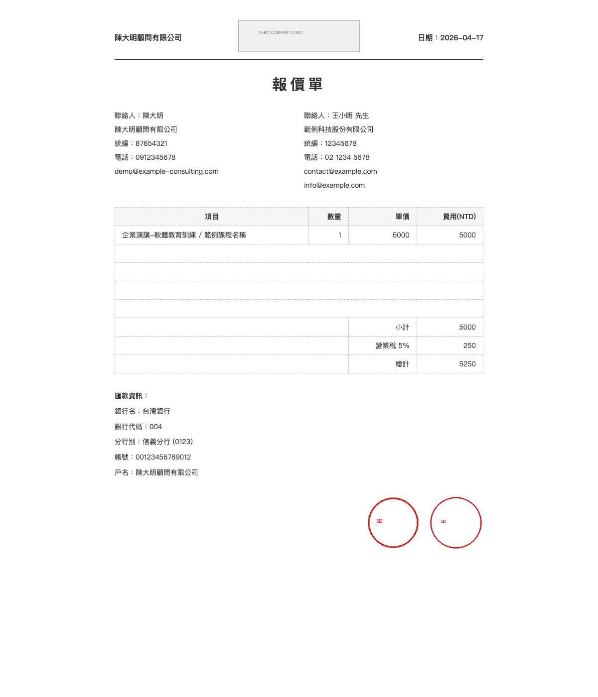

# 報價單產生器

用 Babashka 從 Markdown 輸入檔產生 HTML 報價單。生成的 HTML 為單一自含檔案（圖片以 Base64 內嵌），可直接用瀏覽器開啟或列印成 PDF。

## 為什麼做這個？

對一人 consulting 公司來說，客戶常常會要求先出一份報價單，而且格式要夠正式：含稅價、未稅價、匯款帳號、公司大章小章，一樣都不能少。

現有的 open source invoice 產生器大多針對歐美使用情境設計，不符合台灣的報價習慣；而用 Excel 硬做又難以版本控制、容易排版走位。這個工具的目的，就是讓報價單的來源是一份乾淨的 Markdown 文字檔，產出是一份可直接列印的 HTML。



## 需求

- [Babashka](https://babashka.org/) v1.12+

## 什麼是 Babashka？

[Babashka](https://babashka.org/) 是一個以 GraalVM 原生編譯的 Clojure 執行環境，專為腳本和命令列工具設計。它啟動速度極快（毫秒級），不需要 JVM，卻能執行大部分 Clojure 語法，非常適合用來取代 Bash 腳本。

## 安裝 Babashka

### macOS（使用 Homebrew）

```bash
brew install borkdude/brew/babashka
```

### Linux

```bash
# 使用官方安裝腳本（安裝最新版本）
curl -sLO https://raw.githubusercontent.com/babashka/babashka/master/install
chmod +x install
./install
```

或透過套件管理器（Debian/Ubuntu）：

```bash
curl -s https://packagecloud.io/install/repositories/borkdude/babashka/script.deb.sh | sudo bash
sudo apt-get install babashka
```

### Windows（使用 Scoop）

```powershell
scoop bucket add scoop-clojure https://github.com/littleli/scoop-clojure
scoop install babashka
```

### 驗證安裝

```bash
bb --version
# 輸出應類似：babashka v1.x.x
```

更多安裝方式請參考 [Babashka 官方文件](https://github.com/babashka/babashka#installation)。

## 使用方式

### 0. 設定賣方資訊

複製 `seller.example.md` 為 `seller.md`，填入您的公司資訊（`seller.md` 已加入 `.gitignore`，不會被提交）：

```bash
cp seller.example.md seller.md
# 編輯 seller.md，填入您的公司名稱、統編、電話、匯款帳號等
```

### 1. 建立報價單輸入檔

在 `quotes/` 目錄下建立一個 `.md` 檔 (example.md)：

```markdown
---
date: "2025-06-10"          # 可省略，預設為今天
client_name: 範例科技股份有限公司
client_tax_id: "12345678"   # 若有前導零請加引號
client_contact: 王小明 先生
client_phone: 02 1234 5678
client_emails:
  - contact@example.com
  - info@example.com
tax_rate: 0.05               # 可省略，預設為 0.05（5%）
---

| 項目 | 數量 | 單價 |
|------|------|------|
| 企業演講-軟體教育訓練 / 範例課程名稱 | 1 | 5000 |
```

### 2. 產生報價單

```bash
bb quote.bb quotes/example.md
```

輸出：`output/example.html`

### 3. 轉成 PDF（選用）

用瀏覽器開啟 HTML 後，選「列印 → 另存為 PDF」。

## 欄位說明

### 必填欄位

| 欄位 | 說明 |
|------|------|
| `client_name` | 客戶公司名稱 |
| `client_tax_id` | 客戶統一編號（若有前導零請加引號） |
| `client_contact` | 客戶聯絡人姓名 |
| `client_phone` | 客戶電話 |
| `client_emails` | 客戶 email，可填多個 |

### 選填欄位

| 欄位 | 預設值 | 說明 |
|------|--------|------|
| `date` | 今天日期 | 格式 `"YYYY-MM-DD"`（需加引號） |
| `tax_rate` | `0.05` | 營業稅率（5% = 0.05） |

### 項目表格

Markdown table，欄位名稱必須是「項目」、「數量」、「單價」：

```markdown
| 項目 | 數量 | 單價 |
|------|------|------|
| 服務說明 | 數量(整數) | 單價(整數, NTD) |
| 另一項服務 | 1 | 3000 |
```

費用（數量 × 單價）、小計、稅額、總計均自動計算。

## 執行測試

```bash
bb test
```

## 專案結構

```
quote.bb              ← 主程式（入口點）
bb.edn                ← Babashka 專案設定
seller.example.md     ← 賣方資訊範本（複製為 seller.md 並填入真實資料）
seller.md             ← 賣方資訊（已加入 .gitignore，請自行建立）
src/
  parser.clj          ← 解析 YAML front matter 和 Markdown table
  calculator.clj      ← 計算小計、稅、總計
  assets.clj          ← 圖片 Base64 編碼
  renderer.clj        ← HTML 生成（hiccup）
test/
  parser_test.clj
  calculator_test.clj
  renderer_test.clj
assets/               ← 公司 logo 與印章（已加入 .gitignore，請自行準備）
  logo.png            ← 公司 logo（顯示於報表頭部中央）
  seal-small.png      ← 小章（顯示於報表右下角）
  seal-large.png      ← 大章（顯示於報表右下角）
quotes/               ← 報價單輸入檔（.md）放這裡
output/               ← 產生的 HTML 放這裡
```

## License

This is free and unencumbered software released into the public domain. See [UNLICENSE](UNLICENSE) for details.

## Author

Made by [Laurence Chen](https://replware.dev)
